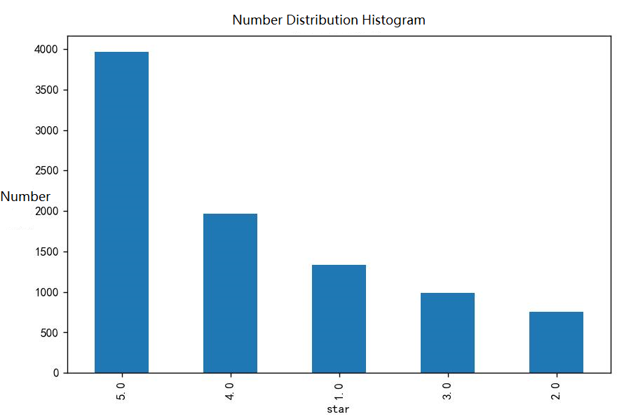

# Sentiment Analysis

#### Introduction

1. Task: Predict the rating (number of stars) of each review of a restaurant/store.
2. Dataset: Yelp dataset ~9k reviews
3. Metric: $\sum{(y_i-\widehat{y_i)}}^2$

#### Dataset Analysis

The data used for training and prediction are from the text and star columns, notice that five-star reviews are the most and two-star reviews are the least.

__Histogram__

#### Solution
1. logistic regression
2. Plain Bayesian model
3. SVM (Support Vector Machine) model

#### Development Environment

1. python3
2. using sklearn

#### Usage

1. include logistic regression and SVM versions
2. use Python and install the appropriate libraries
3. csv file is 9k training data

#### Partial results

1. Logistic regression: 9000 data in total, 8000 used for training and 1000 used for testing, final MSE is 0.986.
2. Parsimonious Bayes: 9000 data, 8000 used for training, 1000 used for testing, final MSE 3.700. (Using TF-IDF/word frequency as features)
3. SVM: total 9000 data, using 8000 for training, 1000 for testing, final MSE 0.93. (using TF-IDF/word frequency as features, using TF-IDF works better; linear SVM/nonlinear SVM, cross-validated by Grid Search grid search for tuning; nonlinear using rbf kernel function for SVM conditions, penalty factor (C=8 works best and gamma=0.1 scores higher)

__Grid Search tuning__

__TF-IDF + SVM results__

