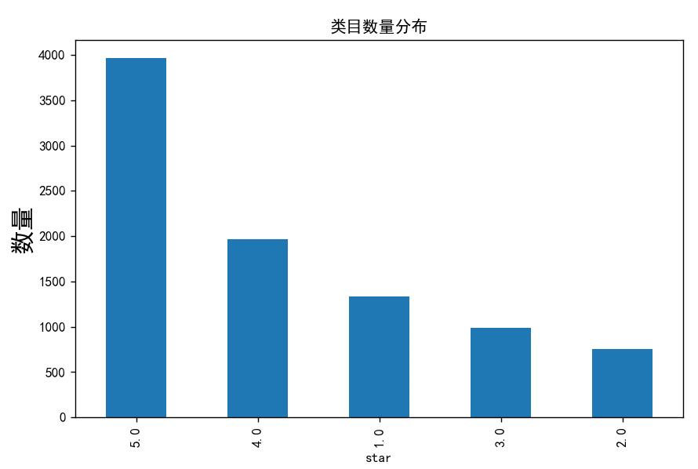
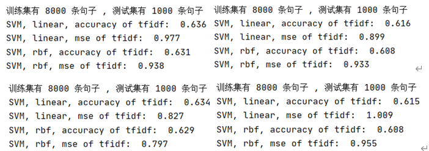
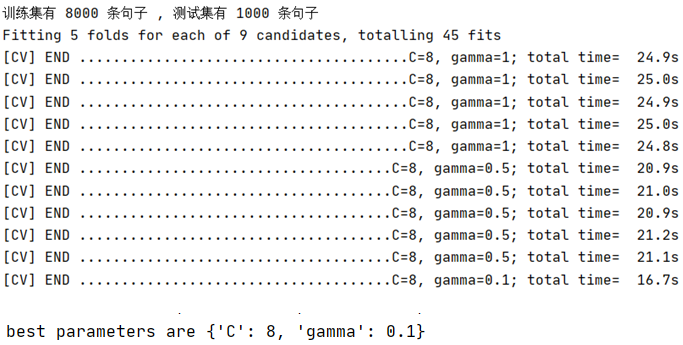
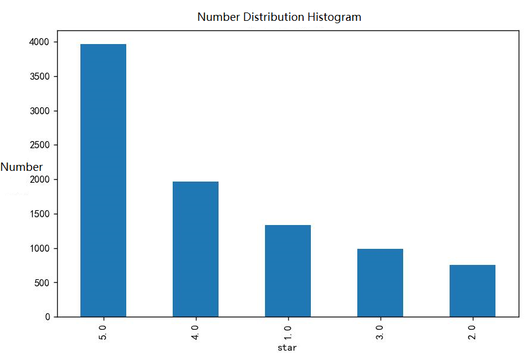

# 情感分析

## 中文

#### 介绍

1.  任务：预测餐厅/商店的每条评论的评级（星数）。
2.  数据集：Yelp数据集~9千条评论
3.  Metric：$\sum{(y_i-\widehat{y_i)}}^2$

#### 数据集分析

进行训练和预测用到的数据来自text和star两列，注意到五星评论最多而二星评论是最少的。

__直方图__

#### 解决方法
1.  逻辑回归
2.  朴素贝叶斯模型
3.  SVM（支持向量机）模型

#### 开发环境

1.  Python3
2.  使用sklearn

#### 使用方法

1.  包含逻辑回归和SVM版本
2.  使用Python并安装相应库
3.  csv文件是9k条训练数据

#### 部分结果

1.  逻辑回归：共9000条数据，使用8000条用于训练，1000条用于测试，最终的MSE为0.986。
2.  朴素贝叶斯：共9000条数据，使用8000条用于训练，1000条用于测试，最终的MSE为3.700。（使用TF-IDF/词频作为特征）
3.  SVM: 共9000条数据，使用8000条用于训练，1000条用于测试，最终的MSE为0.93。（使用TF-IDF/词频作为特征，使用TF-IDF效果更好；线性SVM/非线性SVM，经过Grid Search 网格搜索交叉验证来进行调参；非线性使用rbf核函数的SVM的条件下，惩罚系数C=8效果最和gamma=0.1的评分更高）

__Grid Search调参_

__TF-IDF + SVM结果_

## English

#### Introduction

1. Task: Predict the rating (number of stars) of each review of a restaurant/store.
2. Dataset: Yelp dataset ~9k reviews
3. Metric: $\sum{(y_i-\widehat{y_i)}}^2$

#### Dataset Analysis

The data used for training and prediction are from the text and star columns, notice that five-star reviews are the most and two-star reviews are the least.

__Histogram__

#### Solution
1. logistic regression
2. Plain Bayesian model
3. SVM (Support Vector Machine) model

#### Development Environment

1. python3
2. using sklearn

#### Usage

1. include logistic regression and SVM versions
2. use Python and install the appropriate libraries
3. csv file is 9k training data

#### Partial results

1. Logistic regression: 9000 data in total, 8000 used for training and 1000 used for testing, final MSE is 0.986.
2. Parsimonious Bayes: 9000 data, 8000 used for training, 1000 used for testing, final MSE 3.700. (Using TF-IDF/word frequency as features)
3. SVM: total 9000 data, using 8000 for training, 1000 for testing, final MSE 0.93. (using TF-IDF/word frequency as features, using TF-IDF works better; linear SVM/nonlinear SVM, cross-validated by Grid Search grid search for tuning; nonlinear using rbf kernel function for SVM conditions, penalty factor (C=8 works best and gamma=0.1 scores higher)

__Grid Search tuning__

__TF-IDF + SVM results__

